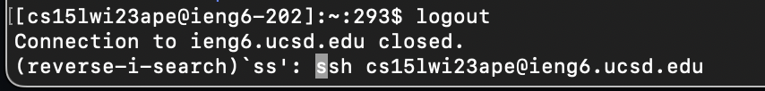
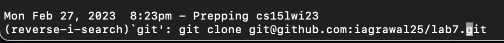
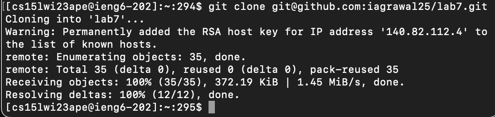
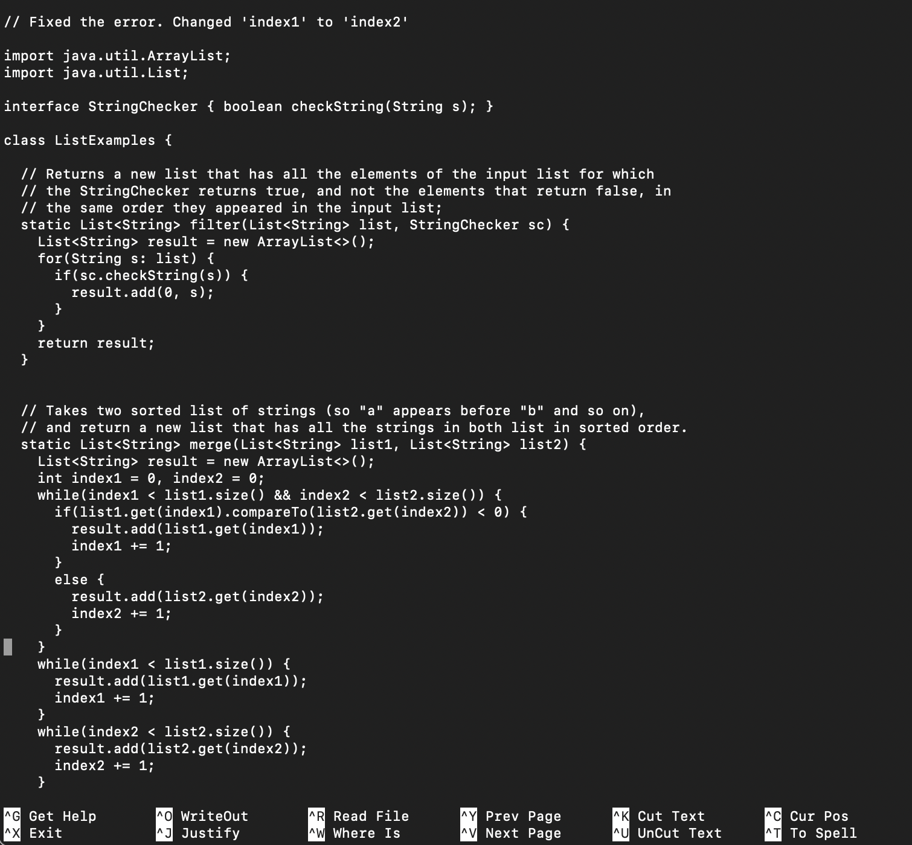
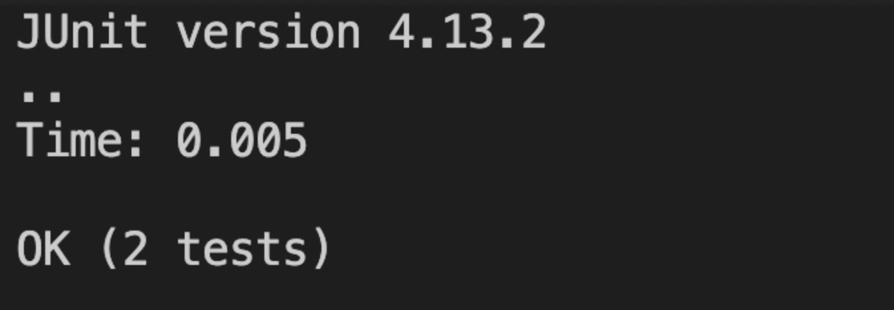
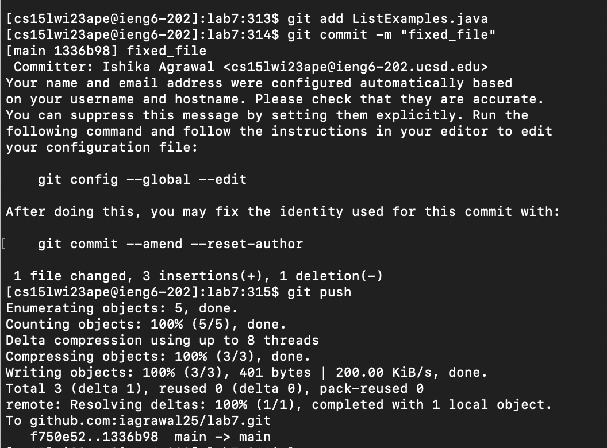

# Lab Report 4
## Step 1: Login
- <CTRL-R> ssh then ```<ENTER>```
  

## Step 2: Clone
- <CTRL-R> git then ```<ENTER>```
  
- Clone the repository
  

## Step 3: Run the tests
- ```<Up><Up><Up><Up><Up><Up><Up><Up><Up><Up><Up><Up>``` (Until I found the command I used previously)
- ```<Backspace><Backspace><Backspace><Backspace><Enter>``` (To edit the name of the file)
  

## Step 4: Edit the code
- Enter: ```nano ListExamples.java```
- Fix the code by changing _index1_ to _index2_
  

## Step 5: Test again
- ```<Up><Up><Up><Up><Up><Up><Enter>``` to reach junit command ```javac -cp .:lib/hamcrest-core-1.3.jar:lib/junit-4.13.2.jar *.java```
- ```<Up><Up><Up><Up><Up><Up><Enter>``` to reach junit command ```java -cp .:lib/hamcrest-core-1.3.jar:lib/junit-4.13.2.jar org.junit.runner.JUnitCore ListExamplesTest```
- We can see that the tests pass now:
  

## Step 6: Commit and Push
- Enter: ```git add ListExamples.java```
- Now, type: ```git commit -m "fixed_file"```
- Finally, push the file: ```git push```
  
