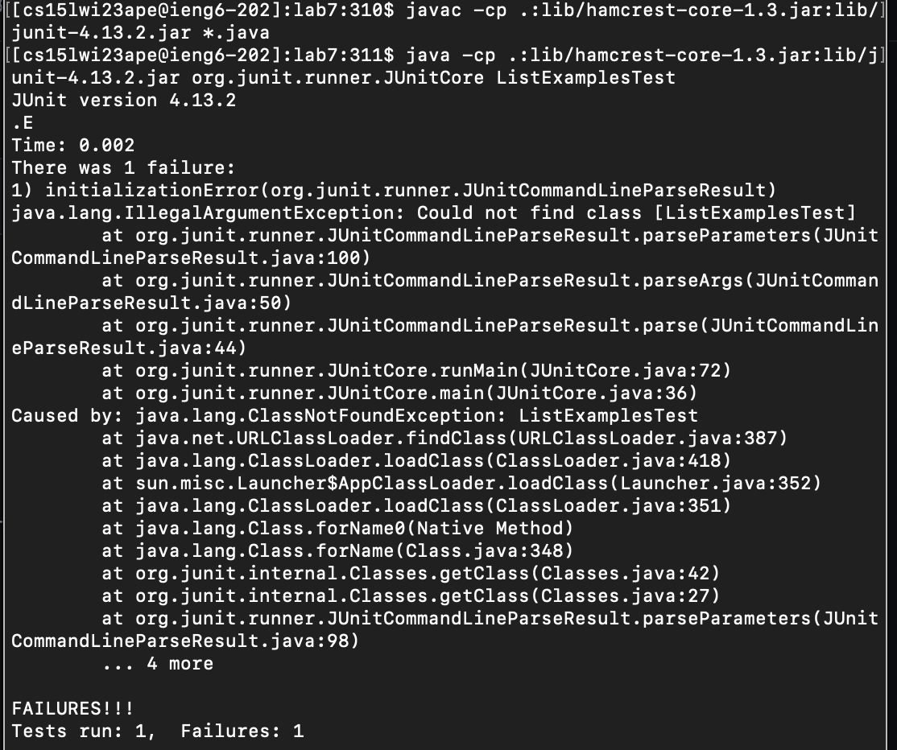

# Lab Report 4
## Step 1: Login
- Press CTRL-R ssh then ```Enter```. CTRL-R helps search for previous commands that you use and makes it easier and faster to work in the terminal. 
- 

## Step 2: Clone
- CTRL-R git then ```Enter```. We will use _git clone_ to clone the git repository.
  
- Clone the repository
  

## Step 3: Run the tests
- ```<Up><Up><Up><Up><Up><Up><Up><Up><Up><Up><Up><Up>``` - Until I found the command I used previously to run the JUNIT tests.
- ```<Backspace><Backspace><Backspace><Backspace><Enter>``` - I edit the name of the file so that I can run the tests.
  

## Step 4: Edit the code
- Enter ```nano ListExamples.java``` to open the file in the terminal and edit it.
- Then, I fixed the code by changing _index1_ to _index2_
  

## Step 5: Test again
- ```<Up><Up><Up><Up><Up><Up><Enter>``` to reach junit command ```javac -cp .:lib/hamcrest-core-1.3.jar:lib/junit-4.13.2.jar *.java```
- ```<Up><Up><Up><Up><Up><Up><Enter>``` to reach junit command ```java -cp .:lib/hamcrest-core-1.3.jar:lib/junit-4.13.2.jar org.junit.runner.JUnitCore ListExamplesTest```
- We can see that the tests pass now:
  

## Step 6: Commit and Push
- Enter ```git add ListExamples.java``` to add the edited file.
- Now, type ```git commit -m "fixed_file"``` to save the changes made to the file.
- Finally, push the file so that it becomes available on git: ```git push```
  
  
- At first, I took _12 minutes_ to do it, but by the last try I took only _1 minute and 48 seconds_.
